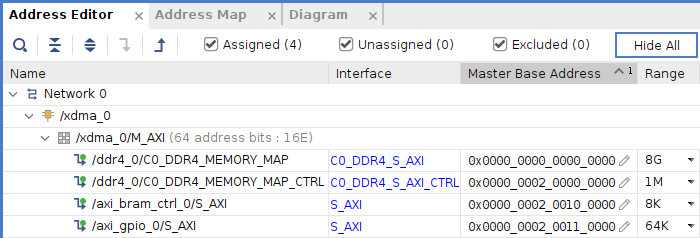
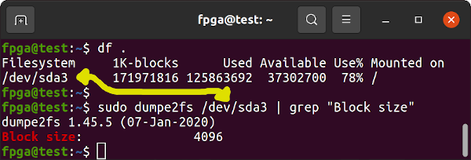

# Innova-2 Flex XCKU15P XDMA PCIe DDR4 GPIO Demo

This is a simple [Vivado 2021.2](https://www.xilinx.com/support/download/index.html/content/xilinx/en/downloadNav/vivado-design-tools/2021-2.html) project for the [XCKU15P FPGA](https://www.xilinx.com/products/silicon-devices/fpga/kintex-ultrascale-plus.html) on the the [Innova-2 Flex SmartNIC MNV303212A-ADL](https://www.nvidia.com/en-us/networking/ethernet/innova-2-flex/) that implements a PCIe XDMA interface to DDR4 and a GPIO output to one of the LEDs. The other LED is connected to a divided down clock and blinks every couple of seconds.


Refer to the [innova2_flex_xcku15p_notes](https://github.com/mwrnd/innova2_flex_xcku15p_notes/) project for instructions on setting up an Innova-2 system with all drivers including Xilinx's PCIe XDMA Drivers, [dma_ip_drivers](https://github.com/Xilinx/dma_ip_drivers).

## Program the Design into the XCKU15P Configuration Memory

Refer to the `innova2_flex_xcku15p_notes` project's instructions on [Loading a User Image](https://github.com/mwrnd/innova2_flex_xcku15p_notes/#loading-a-user-image). Binary Memory Configuration Files are included in this project.

```
cd innova2_xcku15p_ddr4_bram_gpio
md5sum *bin
a07d4e9c498d6ff622a6ec00cb71ed0a  innova2_xcku15p_ddr4_bram_gpio_primary.bin
1bca96206beb99a064d0dc7367b1f0e3  innova2_xcku15p_ddr4_bram_gpio_secondary.bin
```

## Testing the Design

After rebooting, the design should show up as `RAM memory: Xilinx Corporation Device 9038`. It shows up at PCIe Bus Address `03:00` for me.

```
lspci | grep -i Xilinx
sudo lspci  -s 03:00  -v
sudo lspci  -s 03:00  -vvv | grep "LnkCap\|LnkSta"
```


`dmesg | grep -i xdma` provides details on how Xilinx's PCIe XDMA driver has loaded.


The following memory map is used by the block design when communicating using the Xilinx XDMA Test programs from *dma_ip_drivers*.



| Block        | Address (Hex)      | Size  |
| ------------ |:------------------:| :---: |
| DDR4         | 0x0000000000000000 |  8G   |
| DDR4 Control | 0x0000000200000000 |  1M   |
| BRAM         | 0x0000000200100000 |  8K   |
| GPIO         | 0x0000000200110000 |  64K  |


### AXI BRAM Communication

The commands below generate 8kb of random data, then send it to a BRAM in the XCKU15P, then read it back and confirm the data is identical. Note `h2c` is *Host-to-Card* and `c2h` is *Card-to-Host*. The address of the BRAM is `0x200100000` as noted above.
```Shell
cd ~/dma_ip_drivers/XDMA/linux-kernel/tools/
dd if=/dev/urandom bs=1 count=8192 of=TEST
sudo ./dma_to_device   --verbose --device /dev/xdma0_h2c_0 --address 0x200100000 --size 8192  -f    TEST
sudo ./dma_from_device --verbose --device /dev/xdma0_c2h_0 --address 0x200100000 --size 8192 --file RECV
sha256sum TEST RECV
```


### AXI GPIO Control


The design includes an [AXI GPIO](https://docs.xilinx.com/v/u/3.0-English/ds744_axi_gpio) block to control Pin A6, the *D19* LED on the back of the Innova-2. The LED can be turned off by writing a `0x01` to the `GPIO_DATA` Register. Only a single bit is enabled in the port so excess bit writes are ignored. No direction control writes are necessary as the port is set up for output-only (the `GPIO_TRI` Direction Control Register is fixed at `0xffffffff`).


The commands below should turn off then turn on the *D19* LED. First, two one-byte files are created, a binary all-ones byte and a binary all-zeros byte. These are then sent to address `0x200110000`, the `GPIO_DATA` Register. As only a single bit is enabled in the block design, reading from `GPIO_DATA` returns `0x00000001` when the LED is off and `0x00000000` when it is on.
```Shell
cd ~/dma_ip_drivers/XDMA/linux-kernel/tools/
echo -n -e "\xff" >ff.bin   ;   od -A x -t x1z -v  ff.bin
echo -n -e "\x00" >00.bin   ;   od -A x -t x1z -v  00.bin
ls -l  ff.bin  00.bin
sudo ./dma_to_device   --verbose --device /dev/xdma0_h2c_0 --address 0x200110000 --size 1 -f     ff.bin
sudo ./dma_to_device   --verbose --device /dev/xdma0_h2c_0 --address 0x200110000 --size 1 -f     00.bin
sudo ./dma_from_device --verbose --device /dev/xdma0_c2h_0 --address 0x200110000 --size 8 --file RECV
od -A x -t x1z -v  RECV
```


### DDR4 Communication

Memory Management prevents data reads from uninitialized memory. DDR4 must first be written to before it can be read from.

Your system must have enough free memory to test DDR4 DMA transfers. Run `free -m` to determine how much RAM you have available and keep the amount of data to transfer below that. The commands below generate 512MB of random data then transfer it to and from the Innova-2. The address of the DDR4 is `0x0` as noted earlier.

The `dd` command is used to generate a file (`of=DATA`) from pseudo-random data (`if=/dev/urandom`). The value for Block Size (`bs`) will be multiplied by the value for `count` to produce the size in bytes of the output file. For example, `8192*65536=536870912=0x20000000=512MiB`. Use a block size (`bs=`) that is a multiple of your drive's block size. `df .` informs you on which drive your current directory is located. `dumpe2fs` will tell you the drive's block size.

```Shell
df .
sudo dumpe2fs /dev/sda3 | grep "Block size"
```



Note `128MiB = 134217728 = 0x8000000` which can be generated with `dd` using the `bs=8192 count=16384` options.

To test the full 8GB of memory you can increment the address by the data size enough times that all `8Gib = 8589934592 = 0x200000000` has been tested.

If you have 8GB+ of free memory space, generate 8GB of random data with the `dd` command options `bs=8192 count=1048576` and test the DDR4 in one go.

`vbindiff DATA RECV` can be used to determine differences between the sent and received data if checksums do not match.
```Shell
cd ~/dma_ip_drivers/XDMA/linux-kernel/tools/
free -m
dd  if=/dev/urandom  bs=8192  count=65536  of=DATA
sudo ./dma_to_device   --verbose --device /dev/xdma0_h2c_0 --address 0x0 --size 536870912  -f    DATA
sudo ./dma_from_device --verbose --device /dev/xdma0_c2h_0 --address 0x0 --size 536870912 --file RECV
sha256sum DATA RECV
```


#### DDR4 Communication Error

If you attempt to send data to the DDR4 address but get `write file: Unknown error 512` it means DDR4 did not initialize properly. Refer to the `innova2_flex_xcku15p_notes` project's [DDR4 Troubleshooting Notes](https://github.com/mwrnd/innova2_flex_xcku15p_notes/tree/main/Troubleshooting#readme).
```Shell
sudo ./dma_to_device   --verbose --device /dev/xdma0_h2c_0 --address 0x0 --size 8192  -f    TEST
```


### XDMA Performance

Xilinx's *dma_ip_drivers* include a simple performance measurement tool which tests at address `0x0` with a default transfer size of 32kb.
```Shell
cd ~/dma_ip_drivers/XDMA/linux-kernel/tools/
sudo ./performance --device /dev/xdma0_h2c_0
sudo ./performance --device /dev/xdma0_c2h_0
```


## Recreating the Design in Vivado

Run the `source` command from the main Vivado **2021.2** window. Only some versions of Vivado successfully implement this block design.

```
cd innova2_xcku15p_ddr4_bram_gpio
dir
source innova2_xcku15p_ddr4_bram_gpio.tcl
```


Click on *Generate Bitstream*.


When synthesis and implementation complete after about an hour and Vivado generates a programming Bitstream, run *Write Memory Configuration File*, select *bin*, *mt25qu512_x1_x2_x4_x8*, *SPIx8*, *Load bitstream files*, and a location and name for the output binary files. The bitstream will end up in the `innova2_xcku15p_ddr4_bram_gpio/innova2_xcku15p_ddr4_bram_gpio.runs/impl_1` directory as `design_1_wrapper.bit`. Vivado will add the `_primary.bin` and `_secondary.bin` extensions as the Innova-2 uses dual MT25QU512 FLASH ICs in x8 for high speed programming.


Proceed to [Loading a User Image](https://github.com/mwrnd/innova2_flex_xcku15p_notes/#loading-a-user-image)


## Block Design Customization Options

### XDMA

The Innova-2's XCKU15P is wired for **x8** PCIe at *PCIe Block Location:* **X0Y2**. It is capable of **8.0 GT/s** Link Speed.


For this design I set the PCIe *Base Class* to **Memory Controller** and the *Sub-Class* to **RAM**.


I disable the **Configuration Management Interface**.


### DDR4

The DDR4 is configured for a Memory Speed of **833**ps = 1200MHz = 2400 MT/s Transfer Rate. The DDR4 reference clock is **9996**ps = 100.4MHz. This project includes a custom part definition in [innova2_ku15p_MT40A1G16.csv](innova2_ku15p_MT40A1G16.csv) for the [MT40A1G16](https://www.micron.com/products/dram/ddr4-sdram/part-catalog/mt40a1g16knr-075).


*Data Mask and DBI* is set to **NO DM DBI WR RD** which automatically enables ECC on a 72-Bit interface.


The *Arbitration Scheme* is set to **Round Robin** under AXI Options.


